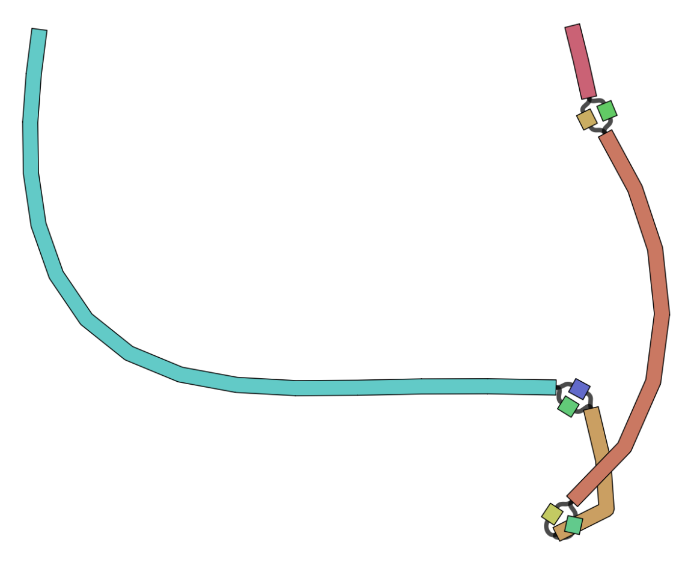

# General idea

Annotating the VCF file with variants using [snpEff](https://pcingola.github.io/SnpEff/), with the following command:
```
java -Xmx8g -jar snpEff.jar NC_045512.2 variants.vcf.gz | gzip > annotated_variants.vcf.gz
```

Second idea, is to take the consensus files after applied the variants to them and check if these variants have affected the proteins and in what way.
The consensus sequence can be made with `bcftools` easily with this command:
```
cat reference.fasta | bcftools consensus variants.vcf.gz > consesnus_sequences.fasta
```

Then taking this output, I can annotate it using a viral annotation tool like [VAPiD](https://github.com/rcs333/VAPiD), and instead of using a big database, we know that we're working with covid-19 genome, so we can give VAPiD the argument `--r NC_045512.2` to use this as reference. VAPiD will produce several files and one of theme is a gene bank file, this can easily then be parsed and the proteins separated. We can also add an identifier to each protein to know from which consesus file it came from.

Next step would be running an MSA algorithm on the same protein (using clustalo or clustalw for example). Then using my MSA to GFA tool, we can generate graphs with bubbles representing the amino acids that were affecteced. 
Command for clustalo:
```
clustalo -i proteins.fasta -o msa_proteins.aln --threads 10 --distmat-out=distance_matrix.mat --force --full --percent-id
```

# Goal
Generating graphs from amino acids can be useful as well, for example, looking at the annotated paths, we can see if there's an equal distribution between the branches of one of the bubbles or we see that predominantly one branch has more samples going through it that others. We can associate these bubbles with certain phenotypes or secondary protein structures, e.g. do these amino acid changes affect the folding of the protin or the binding sites. And these graph can be aligned to with using Partial Order Alignment algorithm, so for new samples and new proteins, we can simply align to these graphs and see which path the new protein took.


Figure1: Example graph of covid protein QHD43422.1 affected by several variants

Workflow

